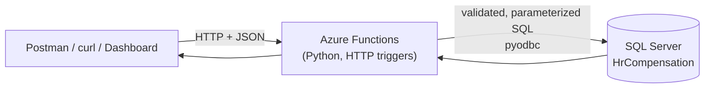

# 💼 Employee Compensation Service


An HTTP backend for managing **employees** and **departments** and answering **bonus / compensation** questions, built as **Azure Functions** (Python) on **SQL Server / Azure SQL**.
🔒 Clients never touch the database: every read and write goes through the Functions layer.

## 📑 Contents
[Architecture](#-architecture) · [Project structure](#-project-structure) · [Stack](#-stack) · [Run locally](#-run-locally-windows) · [API reference](#-api-reference) · [Dashboard](#-dashboard) · [Testing](#-testing) · [Production readiness](#-production-readiness) · [Design decisions](#-design-decisions-and-assumptions) · [Troubleshooting](#-troubleshooting)

## 🏗️ Architecture



Each request is validated, run as parameterized SQL, and answered with JSON and a meaningful HTTP status code.

## 📁 Project structure

```
employee-compensation-service/
├── function_app.py            # 🚪 Entry point: registers all blueprints
├── employees.py               # 👤 Part A: employee CRUD endpoints
├── departments.py             # 🏢 Extra: department CRUD endpoints
├── reports.py                 # 📊 Part B: bonus and compensation reports
├── dashboard.py               # 🖥️ Extra: HTML dashboard (tables + add/edit/delete)
├── validation.py              # ✅ Request validation (pure Python, unit-tested)
├── db.py                      # 🗄️ SQL Server connection + query helpers
├── common.py                  # 📤 JSON responses + error → HTTP status mapping
├── errors.py                  # ⚠️ ApiError type (no dependencies)
├── host.json                  # ⚙️ Functions host configuration
├── requirements.txt           # 📦 azure-functions, pyodbc
├── local.settings.sample.json # 🔑 Template for local settings (copy → local.settings.json)
├── .gitignore / .funcignore   # 🙈 Keeps secrets, .venv and caches out of git/deploys
├── sql/
│   ├── 01_schema.sql          # 🧱 CREATE TABLE scripts (idempotent)
│   └── 02_seed.sql            # 🌱 Sample data (idempotent)
└── tests/
    └── test_validation.py     # 🧪 Unit tests for input validation
```

## 🧰 Stack

| Layer | Choice |
|---|---|
| 🐍 Language | Python 3.11 (Functions v4 supports 3.10–3.12) |
| ⚡ Compute | Azure Functions v4, HTTP triggers, Python v2 programming model |
| 🗄️ Database | SQL Server / Azure SQL via `pyodbc` + ODBC Driver 18 |
| 🖥️ Dashboard | Single HTML page, vanilla JavaScript (no build step) |
| 🧪 Tests | `pytest` |
| 🔬 API testing | Postman / curl |

## 🚀 Run locally (Windows)

**Prerequisites**

| Tool | Notes |
|---|---|
| 🐍 Python 3.11 | Tick "Add to PATH" when installing |
| ⚡ Azure Functions Core Tools v4 | Provides the `func` command (`winget install Microsoft.AzureFunctionsCoreTools`) |
| 🔌 ODBC Driver 18 for SQL Server | Required by `pyodbc` |
| 🗄️ SQL Server (Express/Developer) + SSMS | Or any SQL Server / Azure SQL |
| 📮 Postman | For POST / PATCH / DELETE requests |

**1. Create the database and tables**
```sql
CREATE DATABASE HrCompensation;
```
Then, against `HrCompensation`, run `sql/01_schema.sql` followed by `sql/02_seed.sql` (SSMS or Azure Data Studio).

**2. Create a virtual environment and install packages**
```bash
python -m venv .venv
.venv\Scripts\activate
pip install -r requirements.txt
```

**3. Configure settings.** Copy `local.settings.sample.json` to `local.settings.json` and set your connection string. This file is git-ignored.

Windows authentication, default instance:
```
Driver={ODBC Driver 18 for SQL Server};Server=localhost;Database=HrCompensation;Trusted_Connection=yes;Encrypt=yes;TrustServerCertificate=yes;
```
Named instance (e.g. `MSSQL` or `SQLEXPRESS`): use `Server=localhost\MSSQL`, and **double the backslash in JSON**: `localhost\\MSSQL`.

SQL login (e.g. Docker):
```
Driver={ODBC Driver 18 for SQL Server};Server=tcp:localhost,1433;Database=HrCompensation;Uid=sa;Pwd=<password>;Encrypt=yes;TrustServerCertificate=yes;
```

**4. Start the app**
```bash
func start
```
The terminal lists every function. The API is served at `http://localhost:7071/api/...` (no key needed locally). Keep this window running while you test.

**5. Try it:** open `http://localhost:7071/api/employees` or the [dashboard](#-dashboard).

## 🌐 API reference

Base URL: `http://localhost:7071/api`. Send JSON with `Content-Type: application/json`. Field names match the database columns.

### 👤 Employees (Part A)

| Method | Route | Purpose | Success |
|---|---|---|---|
| `POST` | `/employees` | Create (`Bonus` optional) | `201` + `Location` header |
| `GET` | `/employees/{id}` | Get one | `200` |
| `GET` | `/employees` | List; optional `?departmentId=1` | `200` |
| `PUT` / `PATCH` | `/employees/{id}` | Partial update; `"Bonus": null` clears a bonus | `200` |
| `DELETE` | `/employees/{id}` | Delete | `204` |

```json
// POST /api/employees
{ "FirstName": "Asha", "LastName": "Rao", "DepartmentID": 1, "Salary": 90000, "HireDate": "2024-01-15" }

// PATCH /api/employees/10
{ "Bonus": 3000 }
```

### 🏢 Departments (extra)

| Method | Route | Purpose | Success |
|---|---|---|---|
| `GET` | `/departments`, `/departments/{id}` | List / get (includes `EmployeeCount`) | `200` |
| `POST` | `/departments` | Create; `DepartmentID` optional (next number assigned if omitted) | `201` |
| `PUT` / `PATCH` | `/departments/{id}` | Rename or change location | `200` |
| `DELETE` | `/departments/{id}` | Delete; `409` while employees still belong to it | `204` |

### 📊 Reports (Part B)

| Route | Answers |
|---|---|
| `GET /reports/total-bonus` | Total bonus paid (NULL counts as 0) |
| `GET /reports/no-bonus` | Employees who never received a bonus |
| `GET /reports/bonus-percentage` | Bonus as % of salary, 2 dp (employees with a bonus only) |
| `GET /reports/departments-bonus-exceeds-avg-salary` | Departments where total bonus > average salary |
| `GET /reports/bonus-ranking` | Ranked by bonus; no-bonus employees ranked last, not excluded |
| `GET /reports/top-earner` | Highest-salary employee, and whether they also have the highest total compensation |
| `GET /reports/effective-bonus` | *(Optional)* bonus with a 5% default applied at read time |

With the seed data, `top-earner` returns Aarav Sharma (salary 125,000) with `HasHighestTotalCompensation: false`, because Neha Joshi's total of 143,000 is higher.

### 🚦 Status codes

| Code | Meaning | Example |
|---|---|---|
| `200` | OK | Get / update succeeded |
| `201` | Created | New employee or department |
| `204` | No Content | Delete succeeded |
| `400` | Bad request | Negative salary, invalid JSON, unknown field |
| `404` | Not found | `GET /employees/999` |
| `409` | Conflict | Unknown `DepartmentID`; deleting a department that still has employees |
| `503` / `500` | Server-side | Database unreachable / unexpected error (details logged, never returned) |

### 🧪 Quick examples

PowerShell and Command Prompt quote JSON differently. In Command Prompt (`cmd`), on one line:
```bat
curl -X POST http://localhost:7071/api/employees -H "Content-Type: application/json" -d "{\"FirstName\":\"Asha\",\"LastName\":\"Rao\",\"DepartmentID\":1,\"Salary\":90000}"
curl http://localhost:7071/api/employees/10
curl -X PATCH http://localhost:7071/api/employees/10 -H "Content-Type: application/json" -d "{\"Bonus\":3000}"
curl -X DELETE http://localhost:7071/api/employees/10
```
In Postman: choose the method, paste the URL, and for POST/PATCH/PUT use **Body → raw → JSON**.

## 🖥️ Dashboard

Open `http://localhost:7071/api/dashboard` for a readable view of every endpoint:
- **Employees** and **Departments** tabs have Add / Edit / Delete controls that call the same API (so all validation and status codes still apply).
- Every report has its own tab, rendered as a table.
- When deployed, open it with `?code=<function key>`.

Adding a tab: write the endpoint in `reports.py`, then add one line to the `VIEWS` list in `dashboard.py`.

## 🧪 Testing

```bash
pip install pytest
pytest
```
Unit tests cover input validation. Endpoints are tested manually with Postman against the seeded database; verify writes in SSMS with `SELECT * FROM Employee;`.

## 🛡️ Production readiness

- 🔑 **No secrets in source.** The connection string comes from the `SQL_CONNECTION_STRING` app setting. Locally that is `local.settings.json` (git-ignored). In Azure, use a **Key Vault reference** (`@Microsoft.KeyVault(SecretUri=...)`), or a managed identity with Entra ID authentication so no password exists at all.
- 💉 **Parameterized SQL everywhere**; the only dynamic SQL (column names in updates) comes from a fixed whitelist. This prevents SQL injection.
- ✅ **Validation before the database:** types, lengths, non-negative amounts, max 2 decimal places, ISO dates; unknown or read-only fields are rejected.
- 🚦 **Correct status codes** (table above); internal details are logged, never leaked to clients.
- 🔐 **Authorization:** endpoints use `AuthLevel.FUNCTION` (a function key is required once deployed).
- 🧱 **Database integrity:** foreign key, `CHECK (Salary >= 0)`, `CHECK (Bonus IS NULL OR Bonus >= 0)`, and an index on `Employee.DepartmentID`.

## 🧠 Design decisions and assumptions

- **NULL bonus = no bonus.** A bonus of `0` is a real value and does *not* count as "never received a bonus". NULL is handled explicitly in every query: `SUM(COALESCE(...))`, `IS NULL`, and `Salary + COALESCE(Bonus, 0)`.
- **Ties:** `top-earner` returns lists so results stay correct if two people share the top value. Ranking uses `RANK()`, so equal bonuses share a rank.
- **Bonus %** only covers employees with a bonus; a salary of 0 gives `null` instead of a divide-by-zero.
- **Department comparison** uses `SUM(COALESCE(Bonus,0))` versus `AVG(Salary)` per department.
- **`EmployeeID` is an identity column**, so the database assigns it and clients cannot choose it. Numbers are never reused, so gaps after deletes are normal. `DepartmentID` is not identity, so departments can be given a chosen ID.
- **`DepartmentID` is required** when creating an employee.
- **PUT and PATCH** both perform a partial update (only the fields sent change).
- **JSON uses column names** (`FirstName`, `Salary`, ...) so the API mirrors the data model one-to-one.
- **Not implemented:** pagination on list endpoints (would use `OFFSET/FETCH`), and `HEAD`/`OPTIONS` handlers.

### 🎁 Default 5% bonus: calculated on read, not written
`/reports/effective-bonus` applies the default at query time (rate configurable via the `DEFAULT_BONUS_RATE` setting) instead of writing it into the table:
1. **It keeps `NULL` meaningful.** Writing 5% would make "no bonus" and "default bonus" indistinguishable and corrupt reports like *never received a bonus* and *total bonus paid*.
2. **It stays correct** if salary or the policy rate changes, with no stale data to backfill.
3. **It is reversible and auditable.** Nothing is lost, and rows are flagged with `IsDefaultBonus`.

Writing it would only make sense if the default were an actual payout decision that must be recorded as a fact (ideally with an audit trail).

## ☁️ Deploying to Azure (optional)

1. Create an **Azure SQL Database** and run the two scripts in `sql/`.
2. Create a **Function App** (Python 3.11, Linux) and deploy with `func azure functionapp publish <app-name>`.
3. Set the `SQL_CONNECTION_STRING` app setting (ideally as a Key Vault reference) and `DEFAULT_BONUS_RATE`.
4. Call endpoints with the function key (`?code=...` or the `x-functions-key` header).

## 🩺 Troubleshooting

| Symptom | Likely cause and fix |
|---|---|
| `'func' is not recognized` | Core Tools not installed or not on PATH. Reopen the terminal after installing, or add `C:\Program Files\Microsoft\Azure Functions Core Tools` to PATH, or run it by full path. Don't re-run `activate` in the same window. |
| `Data source name not found and no default driver specified` | ODBC driver missing or named differently. Run `python -c "import pyodbc; print(pyodbc.drivers())"` and use the exact name in `Driver={...}`. |
| `Login failed` / cannot open database | Wrong credentials, wrong database name, or the SQL scripts weren't run. |
| Server not found with a named instance | Start the **SQL Server Browser** service, or connect by TCP port. Double the backslash in JSON (`localhost\\MSSQL`). |
| `400 Request body must be valid JSON` | The JSON isn't in **Body → raw → JSON** (Postman), or the quotes are wrong (curl). |
| `AzureWebJobsStorage ... Unhealthy` warning | Harmless for HTTP-only functions locally. |
| Report numbers differ from this README | Test edits changed the seed data. Reset: `UPDATE Employee SET Bonus = NULL WHERE EmployeeID = 2;` and delete test rows. |
